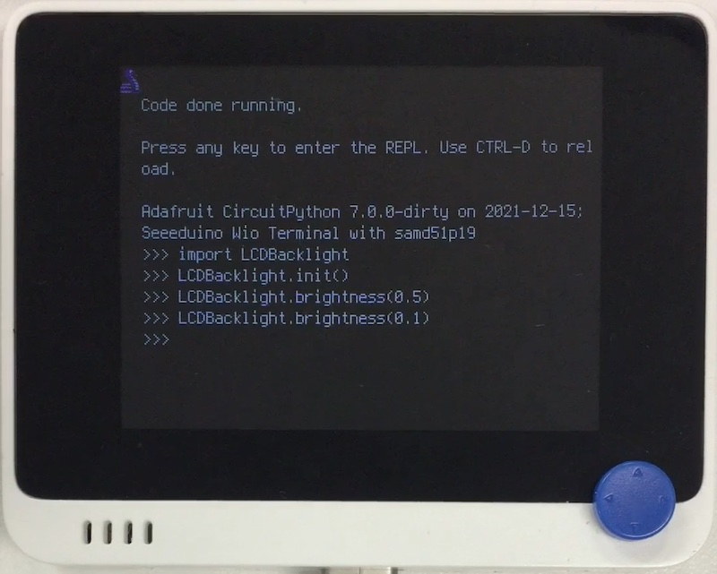

# LCD Backlight

## Summary
A ~~rip-off~~ python port of the following:<br/>
https://github.com/ciniml/WioTerminal_BackLight

LCD backlight pin (PC05) is not connected to any TC/TCC, but can be modulated by TC3 via EVSYS.

[](https://www.youtube.com/watch?v=SCwD3HbOAVk)

## Library
   `LCDBacklight.mpy`

## 操作
```
import LCDBacklight

LCDBacklight.init()
LCDBacklight.brightness(0.5)
# do-whatever-you-want
LCDBacklight.deinit()
```
