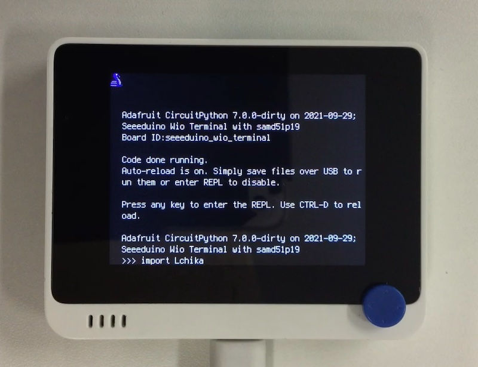

# L チカ

## 概要
言わずと知れた LED チカチカ。
[](https://www.youtube.com/watch?v=bW0nF_W6Qbg)

## ファイル
   `Lchika.py`, `LED.bmp`

## ライブラリ
   `ButtonEvents.mpy`, `adafruit_imageload`

## 操作
```
import Lchika
```

- ↑↓ : 点滅速度の増減
- ←→ : 色の変更
- 1 : 終了

終了後は Ctrl-D でソフトリセット。

シリアルコンソールのキーボードからも操作可能。(ButtonEvents の機能)
   


