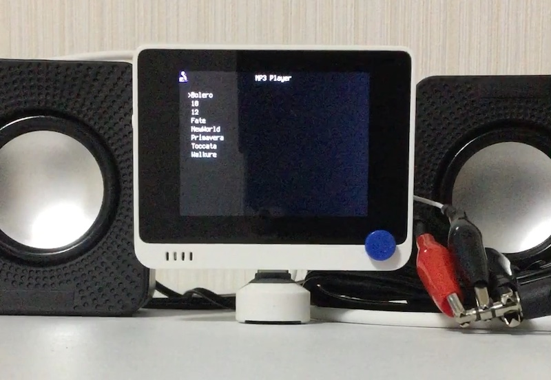
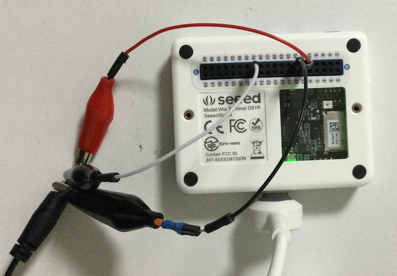

# Audio Player

## 概要
SD カードに保存された MP3 ファイルを再生します。
外部ハードウェアとしてダイソーの 300 円スピーカーを使用します。

[](https://www.youtube.com/watch?v=s8dfvTYT9N0)

## ファイル
   [`AudioPlayer.py`](/CIRCUITPY/AudioPlayer.py), `/sd/Music/*.mp3`

## 操作
Wio Terminal の DAC 出力にダイソースピーカーを接続します。
- 14 版 (GND)  → グランド
- 11 番 (DAC0) → 左チャンネル
- 26 版 (DAC1) → 右チャンネル
```
     ---| 
        |-----|---|---\
	|-----|---|---/
     ---| GND   R   L
```
実態配線図:<br/>


DAC の出力はフルスケール 3.3 V です。
ダイソースピーカーの入力は 50 kΩで GND に落ちているので、問題ないはず。
