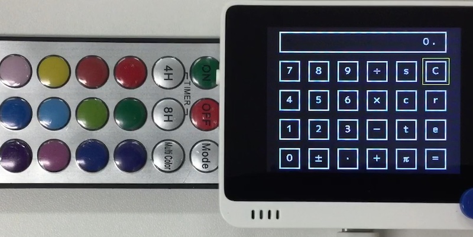

# 電卓

## 概要
こちらの~~パクリ~~移植。<br/>
https://www.seeedstudio.com/blog/2020/07/30/pycalculator-by-circuitpython-on-wio-terminal-handle-the-input-and-calculations-with-joystick/

12 桁電卓を結構まじめに実装しました。
IR リモコンを使った入力も可能です。

[](https://www.youtube.com/watch?v=jnA3pM0FfNg)

## ファイル
   [`calc.py`](/CIRCUITPY/calc.py)

## ライブラリ
   [`Calculator.mpy`](/libsrc/Calculator.py), [`Qnum.mpy`](/libsrc/Qnum.py)

## 操作
- ↑↓←→ でカーソルを移動し、"X" で入力します。
- s, c, t, r, e はそれぞれ、sin, cos, tan, sqrt, exp に相当します。
- "C" を 2 回たたくと AC 相当になります。
- "2" で Memory への一時退避、"3" で Memory からの呼び出しです。

IR リモコンを使った入力も可能です。
現状、ダイソーの 300 円リモコンライトのリモコンを対象に実装してあります。<br/>
縦置き:
```
|---+---+---|
| / | - | C |
| * | + | r |
| 7 | 8 | 9 |
| 4 | 5 | 6 |
| 1 | 2 | 3 |
| 0 | . | = |
|---+---+---|
```
