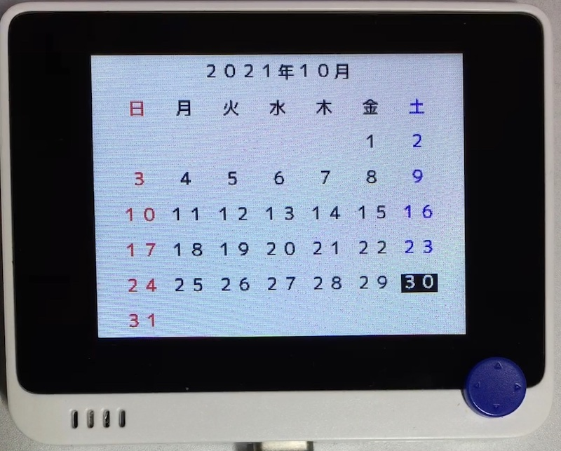

# カレンダー

## 概要
カレンダーを表示します。
日付は当面、nixie_clock で設定してください。

## ファイル
   [`calendar.py`](/CIRCUITPY/calendar.py)

## ライブラリ
   [`TinyCalendar.mpy`](/libsrc/TinyCalendar.py)

## 操作
- ←→ : 前後の月に移動します。
- ↑↓ : 前後の年に移動します。

