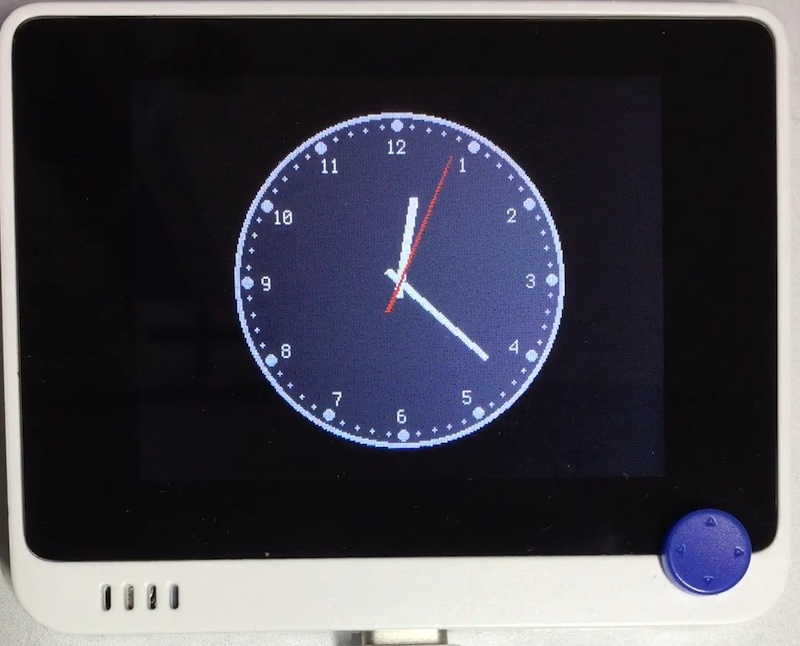

# アラーム時計

## 概要
時計を表示します。アラーム付きです。
日付は当面、nixie_clock で設定してください。

## ファイル
   [`clock.py`](/CIRCUITPY/clock.py)

## ライブラリ
   [`AnalogClock.mpy`](/libsrc/AnalogClock.py)

## 操作
日中と夜間で文字盤の色が変わります。
"3" でアラームの設定に入ります。
- "2" : 現在時刻に移動
- ←→ : 細かく設定 (1 分単位)
- ↑↓ : 粗く設定 (15 分単位)
- "X" : アラームの on/off (針の色が変わります。)
- "3" : 設定終了

