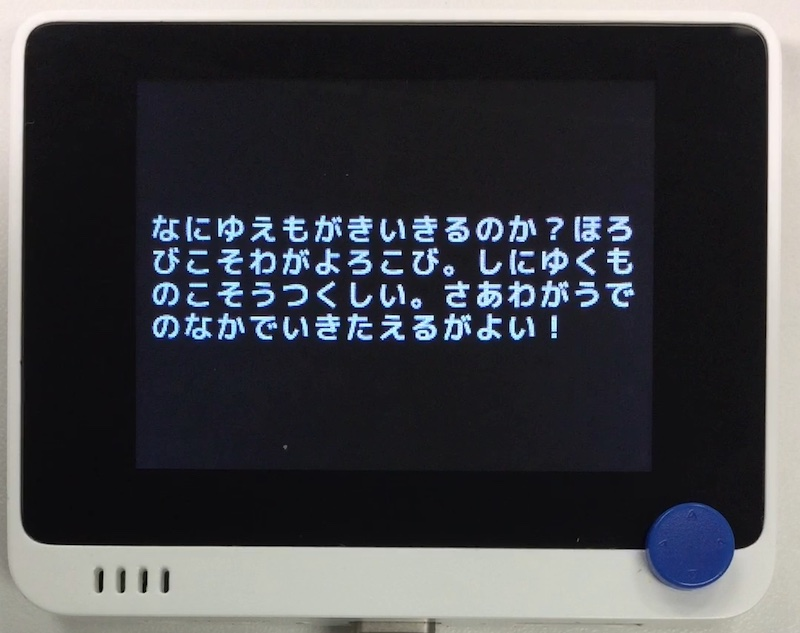

# ひらがな表示

## 概要
terminalio を悪用してひらがなを表示するデモです。

文字データはこちらから拝借しました。 
https://rictyfonts.github.io

## ファイル
   `dq.py`, `font/RictyBold.bmp`, `font/RictyBoldH.bmp`

## ライブラリ
   `RictyBoldTerminal.mpy`

