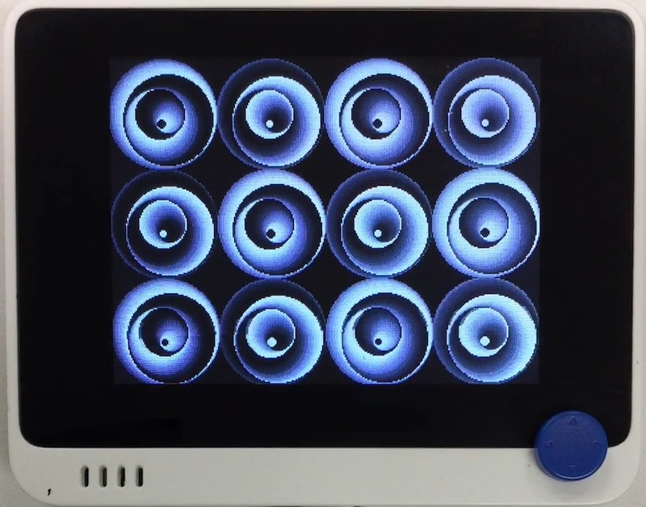

# グロフィックス

## 概要
Bitmap への描画ライブラリを整備しました。

[](https://www.youtube.com/watch?v=D_v0U4ZifK4)

## ファイル
   [`grophics.py`](/CIRCUITPY/grophics.py)

## ライブラリ
   [`BitmapFrameBuffer.mpy`](/libsrc/BitmapFrameBuffer.py)

## 操作
```
import grophics
```
