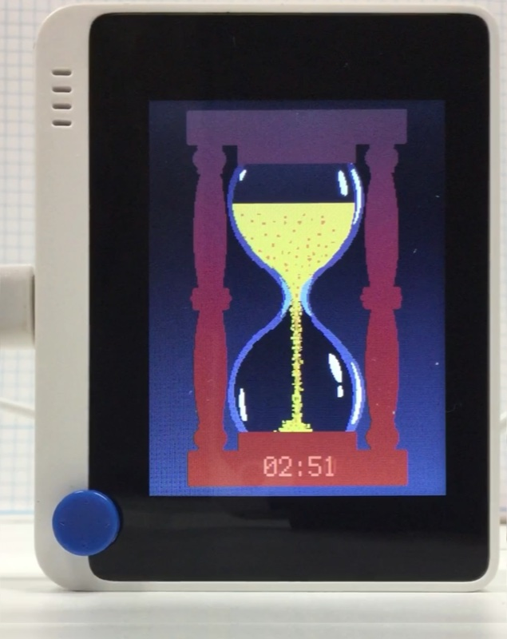

# 砂時計

## 概要
3 分計です。

[](https://www.youtube.com/watch?v=BhjzPFRIgL4)

## ファイル
   [`hour_glass.py`](/CIRCUITPY/hour_glass.py), `HG_Lower.bmp`, `HG_Upper.bmp`, `HG_Glass.bmp`, `HG_Sand.bmp`

## ライブラリ
   [`HourGlass.mpy`](/libsrc/HourGlass.py)

## 操作
```
import hour_glass
```

止まってから 10 秒で画面が消えます。
ひっくり返すと再開します。
