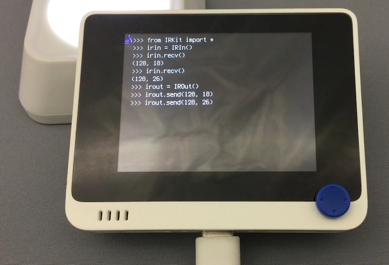

# 赤外線リモコン

## 概要
IR リモコンの送受信。

- 送信側は搬送波 (38 kHz) で変調をかけます。
- 受信側は搬送波の検出はできません。
  - 前項光センサで、Wio Terminal 背面窓に IR リモコンを向けると針が反応します。
  - 回路図を見ると、PIN photo diode に順方向バイアスをかけ、電流量を 10kΩ 抵抗で検出しています。
  - シグナルの rise は早いですが fall は遅い (200 us くらい) ようです。
  - したがって、搬送波の ON/OFF には追随できませんが、リモコンの信号パルス列は検出可能です。

[](https://www.youtube.com/watch?v=tC1Tco1loHk)

** ライブラリ
   `IRKit.mpy`

** 操作
```
from IRKit import *
irin = IRIn()
# <リモコン照射>
irin.recv()	# → (128, 18)

irout = IROut()
irout.send(128, 18)
```

NEC フォーマットの送受信に対応しています。
その他のフォーマットは IRIn の諸関数を使って解析し、IROut を継承して送出することになります。
受信側は 38 kHz 変調を無視しているので、環境光に対して弱く、長距離からの受信はできません。
活用例としては電卓アプリを参照。
  
