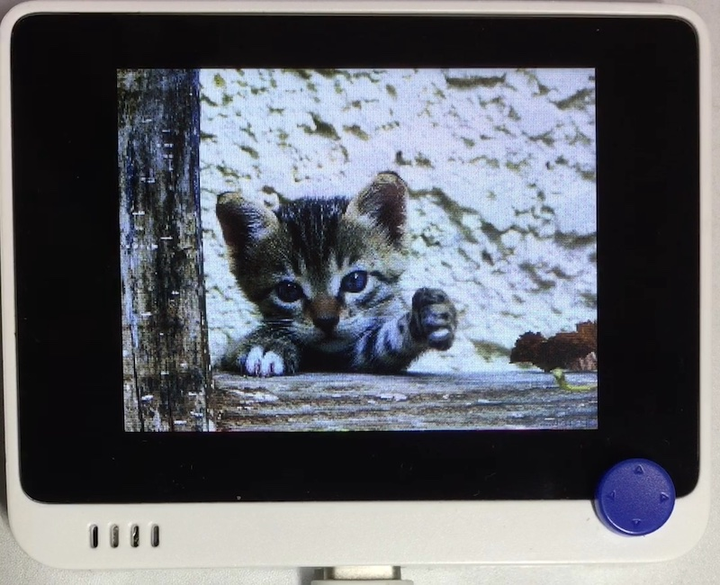

# ImageViewer

## 概要
SD カードをマウントし、Pictures ディレクトリ内の画像を表示します。
画像は 320x240 の BMP 形式 (256 色インデックスカラー) で保存します。

## ファイル
   `ImageViewer.py`, `/sd/Pictures/*.bmp`

## ライブラリ
   `mount_sd.mpy`

## 操作
約10秒で次の画像に切り替わります。
←→ で画像を送ることもできます。

