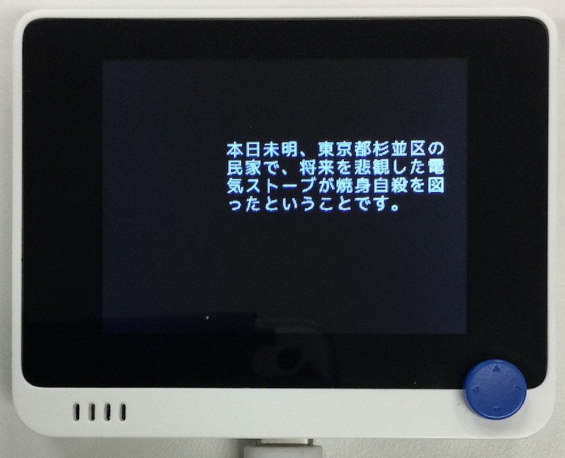

# 漢字表示

## 概要
常用漢字+αを Bitmap に描画するライブラリです。
文字サイズは 16x16 固定。4 色表示。半角には対応していません。

文字データはこちらから拝借。<br/>
https://rictyfonts.github.io <br/>



## ファイル
   `font/RictyKanji.bin`

## ライブラリ
   `RictyKanji.mpy`

## 操作
```
#+begin_example
import displayio as dpio
import board
from RictyKanji import draw_text, set_palette

disp = board.DISPLAY
g = dpio.Group()
bmp = dpio.Bitmap(300, 200, 4)
pal = dpio.Palette(4)
set_palette(pal)
tg = dpio.TileGrid(bmp, pixel_shader = pal)
g.append(tg)
g.x = 10
g.y = 20
disp.show(g)

draw_text(bmp, 100, 50, "本日未明、東京都杉並区の民家で、将来を悲観した"
          "電気ストーブが焼身自殺を図ったということです。", width = 12)
```
