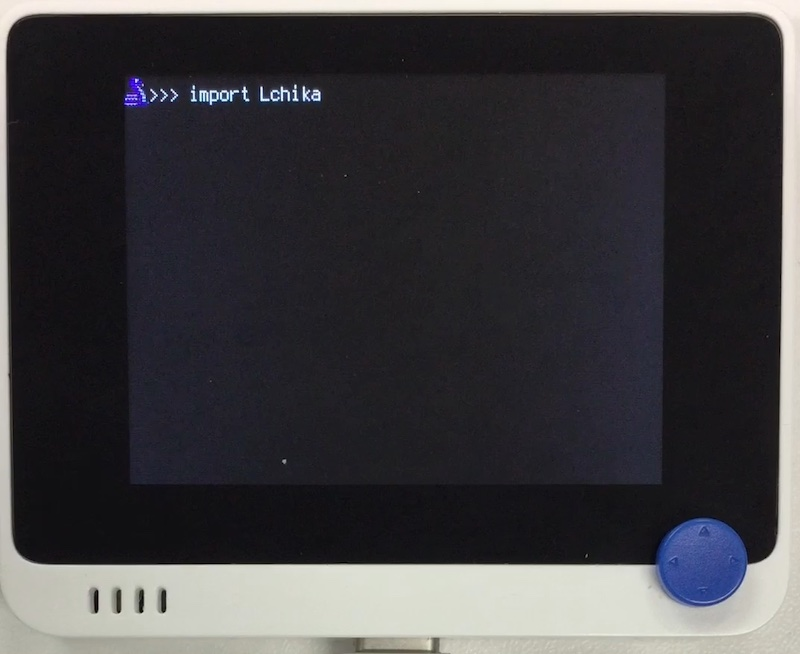

# L チカ

## 概要
LED をチカチカさせます。

[](https://www.youtube.com/watch?v=nFXDlmaoZ0o)

## ファイル
   `Lchika.py`, `LED.bmp`

## ライブラリ
   `ButtonEvents.mpy`, `adafruit_imageload`

## 操作
```
import Lchika
```

- ↑↓ : 点滅速度の増減
- ←→ : 色の変更
- 1 : 終了

終了後は Ctrl-D でソフトリセットします。
キー操作はシリアルコンソールのキーボードからも可能です。(ButtonEvents の機能)
   


