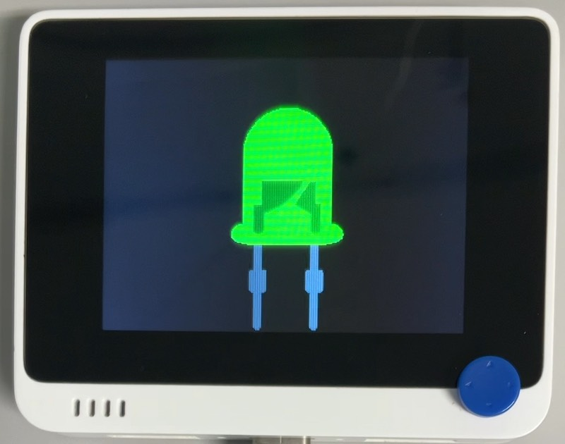

# L チカ (asyncio)

## 概要
asyncio を使って LED をゆっくり点滅します。

## ファイル
   [`Lchika_async.py`](/CIRCUITPY/Lchika_async.py)

## ライブラリ
   [`asyncio`](https://github.com/adafruit/Adafruit_CircuitPython_asyncio)

## 操作
- ↑↓ : 点滅速度の増減
- ←→ : 色の変更
- 1 : 終了

