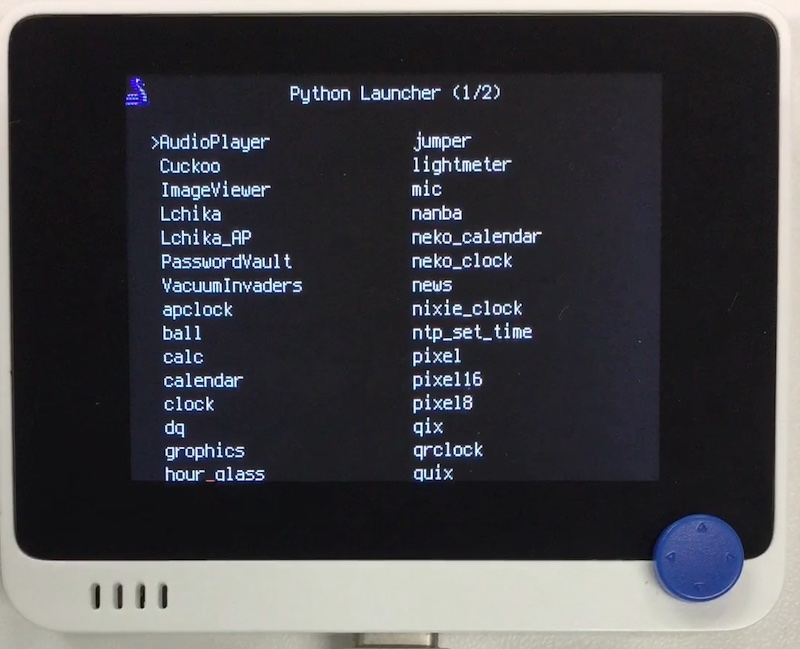

# メニュー表示

## 概要
`*.py` ファイルを選択して実行 (import) します。
起動時に RTL8720 を disable して消費電流を削減します。(平常時 5 V 100 mA が 70 mA になります。)
起動したアプリケーションが終了すると、自動的にソフトリセットがかかり、復帰します。

## ファイル
   `main.py`

## ライブラリ
   ` Menu.mpy`, `wio_terminal_rtl/__init__.mpy`

## 操作
CIRCUITPY ドライブ上の code.py 等を削除し、
シリアルコンソールから Ctrl-D でソフトリセットすると、メニューが起動します。
↑↓←→で選択し、"X" て実行。終了するには "1" を押します。
