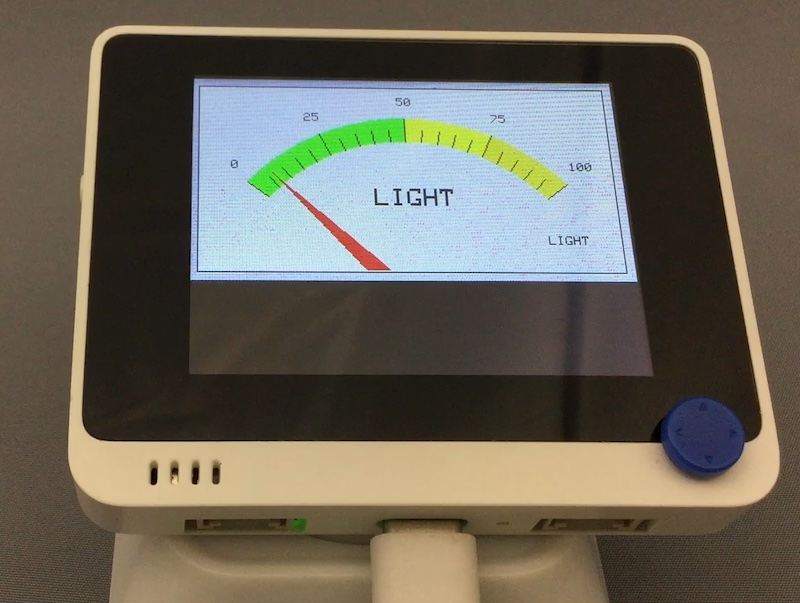

# Meter

## 概要
こちらの~~パクリ~~移植。<br/>
https://www.seeedstudio.com/blog/2020/06/17/piechart-and-meters-reading-using-wio-terminal-and-ardupy/ <br/>

[](https://www.youtube.com/watch?v=81uXKjxUL8U)

## ファイル
   `lightmeter.py`, `font5x8.bin` ([準備](Setup.md) 参照)

## ライブラリ
   `Meter.mpy`

## 操作
```
import lightmeter
```

背面窓内の光センサに反応して針が揺れます。
