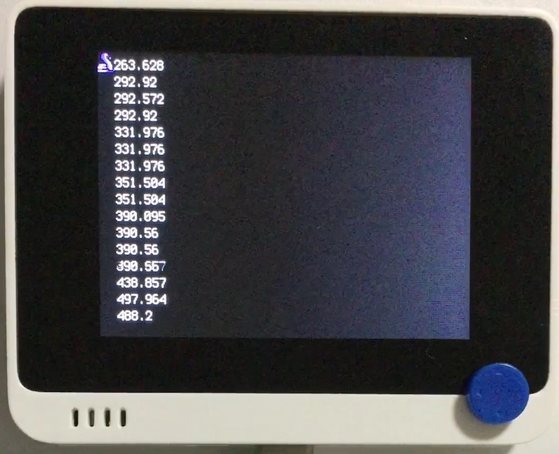

# 周波数表示 (マイク)

## 概要
音を検出してその周波数を表示します。

マイクからの入力を ADC で取得しています。
CircuitPython から `analogio.AnalogIn` を繰り返し呼ぶことで、最大 25 kHz のサンプリングが可能です。
マイク入力は 0.7 V を中心に 0-2.6 V の範囲で振れます。3.3 V まで届きません。
回路図上はコンデンサマイクに LMV358 がつながっていますが、実装されているのは LM358?

## ファイル
   [`mic.py`](/CIRCUITPY/mic.py)

