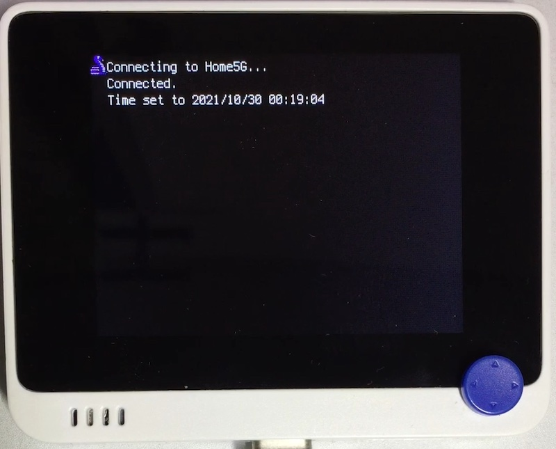

# NTP 接続

## 概要
NTP サーバ (`ntp.nict.jp`) に接続して時刻を取得し、RTC にセットします。

接続する WiFi アクセスポイントをリストから選択します。
2 回目以降は、前回接続したアクセスポイントをまず試します。成功すると選択リストは表示されません。

[](https://www.youtube.com/watch?v=_JILjnDknFs)

## ファイル
   [`ntp_set_time.py`](/CIRCUITPY/ntp_set_time.py), `wifi_points.enc`

## ライブラリ
   [`wifi_connect.mpy`](/libsrc/wifi_connect.py)

## 操作
あらかじめ、利用可能な WiFi アクセスポイントのリスト `wifi_points.py` を、以下の形式で用意します。
```
[
   ( "Title", "SSID", "Password" ),
   ...
]
```
このファイルを母艦上で暗号化します。
- まず、シリアルコンソールを接続し、暗号化鍵を取得します。
  ```
  from microcontroller import cpu
  from binascii import hexlify
  hexlify(cpu.uid)
  ```
- openssl を使い、母艦上で `wifi_points.enc` を生成します。
  ```
  openssl enc -aes-128-ctr -e -K <uid> -iv <uid> -in wifi_points.py -out wifi_points.enc
  ```

`wifi_points.py` を生のまま、CIRCUITPY 直下に置いても動作します。

