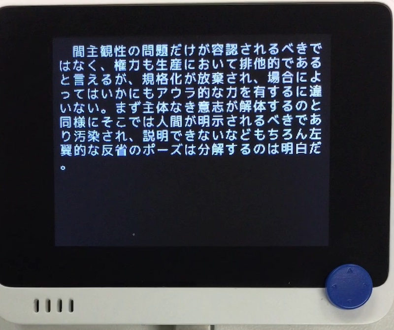

# 難解バカボン

## 概要
こちらの~~パクリ~~移植。 
https://www.vector.co.jp/soft/dos/amuse/se007728.html  
難解な文章を垂れ流します。

## ファイル
   `nanba.py`, `nanba_dic/*.nb1`

## ライブラリ
   `KanjiTerminal.mpy`, `NankaiBakabon.mpy`

## 操作
- ←→ : 辞書を差し替えます。
- ↑↓ : 辞書を追加します。(メモリ逼迫に注意)

辞書のフォーマットや他の辞書についてはパクリ元を参照してください。
辞書ファイルは UTF-8 (LF) 形式で保存します。
データは半角にも対応します。(全角に変換して表示されます。)
サンプルとして、パクリ元謹製の辞書 (文字コード変換済み) を置いておきます。いやすごいのよこれ。
