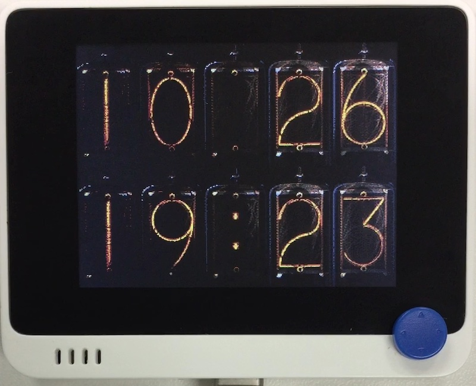

# ニキシー管時計

## 概要
こちらの~~パクリ~~移植。 
https://macsbug.wordpress.com/2020/05/25/wio-nixie-tube-clock/  
画像データをありがたく拝借しました。

内蔵の時計を使用するので、外部回路は不要です。

## ファイル
   [`nixie_clock.py`](/CIRCUITPY/nixie_clock.py), `nixie.bmp`

## ライブラリ
   [`NixieDisplay.mpy`](/libsrc/NixieDisplay.py)

## 操作
- "X" で 日時表示→LightMeter→秒表示 と切り替わります。 
  LightMeter は上段が生の整数データ、下段が V (x100) 単位に変換したものです。
- "3" で日時設定モードに入ります。
  - ↑↓←→で選択、"2", "3" で設定、"1" で終了
  - 年は 2021 で固定です。
  - 一旦、設定した日時はアプリケーションを終了しても維持されます。
    スイッチでリセットをかけると初期化されます。
- ひっくり返すと表示も上下反転します。
