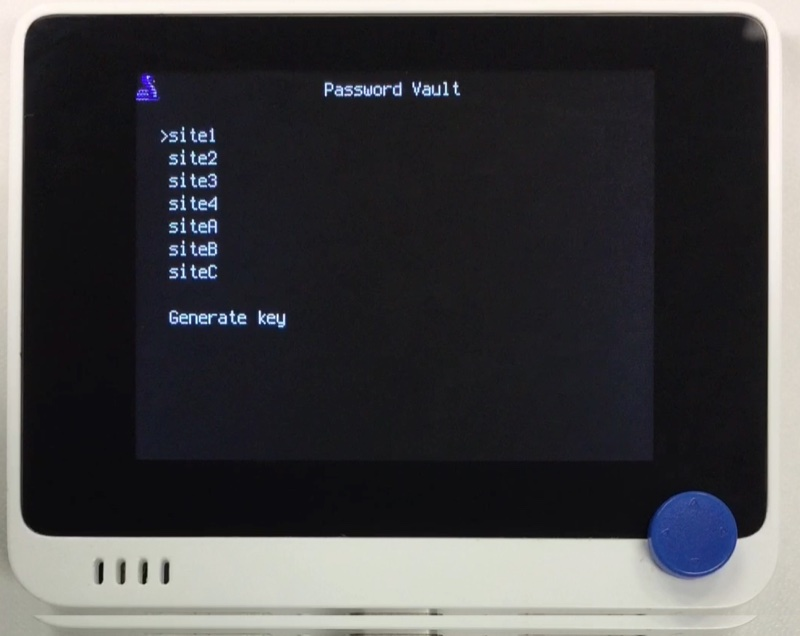

# PasswordVault

## 概要
こちらの~~パクリ~~移植。<br/>
https://www.instructables.com/PasswordVault-Make-a-Wio-Terminal-Type-Your-Passwo <br/>

選択したパスワードを Wio Terminal がキーボードがわりになって USB 経由で入力してくれます。
パスワードは母艦側で暗号化し、`vault.enc` ファイルに保存します。
起動時にコナミコマンドを入力してアンロックします。

[](https://www.youtube.com/watch?v=4H1D4gQJL-o)

## ファイル
   [`PasswordVault.py`](/CIRCUITPY/PasswordVault.py), `vault.enc` (最初は空のファイルを用意)

## ライブラリ
   `adafruit_hid/`

## 操作
### 初回
- 空の `vault.enc` ファイルを CIRCUITPY 直下に作成します。
- シリアルコンソールを接続し、`import PasswordVault` で起動します。
- コナミコマンドの入力要求に対して、"1" で抜け出します。
- Generate key を選択し、コナミコマンドを 2 回入力します。
  コナミコマンドは ↑↓←→, "X", "2", "3" の組み合わせで最大 16 文字まで。"1" で終了です。
- 表示に従ってパスワードファイル (`valut.enc`) を作成し、上書きコピーします。
- "1" で終了です。

### `vault.enc` の作成
- 次のような形式でパスワードファイル `vault.py` を用意します。
  ```
  [ [ "site1", "pass1" ],
    [ "site2", "pass2" ],
    [ "site3", "pass3" ],
    [ "site4", "pass3" ],
  ]
  ```
- 表示される key と iv を使い、母艦側で openssl を使って `vault.enc` を作成します。
  ```
  openssl enc -aes-128-ctr -e -K <key> -iv <iv> -in vault.py -out vault.enc
  ```
- `valut.enc` を CIRCUITPY 直下にコピーします。

生成したパスワードファイルはキー生成に使用した Wio Terminal 専用です。
他の Wio Terminal 上では解錠できません。
  
### 本番
- Wio Terminal を USB 接続し、PasswordVault を起動します。
- 定義したコナミコマンドを入力します。
- サイトを選択すると、対応するパスワードが USB に送出されます。
     
