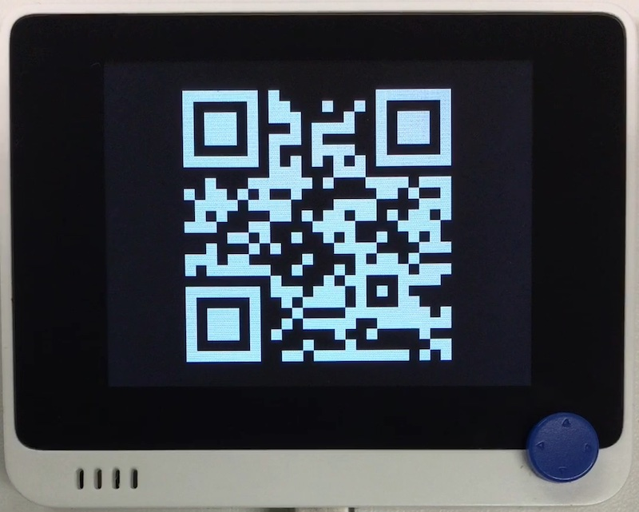

# QR コード時計

## 概要
こちらの~~パクリ~~移植。 
https://play.google.com/store/apps/details?id=net.loves8bit.qrclock

時刻を QR コードで表示します。

## ファイル
   [`qrclock.py`](/CIRCUITPY/qrclock.py)

## ライブラリ
   `adafrui_miniqr.mpy`

