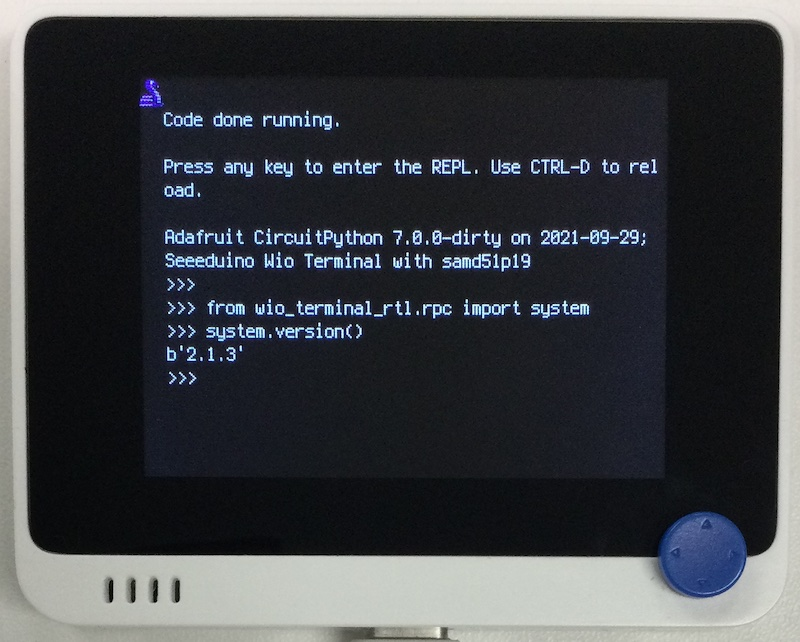

# ネットワーク接続

## 概要
こちらの~~パクリ~~移植。<br/>
https://github.com/Seeed-Studio/Seeed_Arduino_rpcUnified

RTL8720 と UART 経由で [eRPC](https://github.com/EmbeddedRPC/erpc) 通信するライブラリです。
Bluetooth 系も実装してありますが、未検証です。(RTL8720 からのコールバックに対応していません。)



## ライブラリ
   `wio_terminal_rtl/*`

## 操作
```
from wio_terminal_rtl.rpc import system
system.version()
```

## 問題点
いくつかの Web site に WiFiClientSecure で接続できません。
`ssl.start_client` が `-0x7280:CONN_EOF` で失敗します。
暗号化スイート `ECDHE-RSA-AES256-GCM-SHA384` が選択されると、失敗するように見えます。
ライブラリに不備があり、設定すべき項目を見逃しているのかもしれません。
何かお気づきの点がございましたら、ご一報いただけると幸いです。

テスト用スクリプトを `test_WiFiClientSecure` 以下に置いておきます。
- 成功例 : `test_secure.py`
- 失敗例 : `test_tenki.py`

eRPC の定義がいくつか間違っているようです。
```
rpc_lwip_select(int32 maxfdp1, in binary readset @nullable, in binary writeset @nullable, in binary exceptset @nullable, in binary timeout @nullable) -> int32
rpc_wifi_ssl_get_cliCert(uint32 ssl_client, string cli_cert @nullable @max_length(2048)) -> uint32
rpc_wifi_ssl_get_cliKey(uint32 ssl_client, string cli_key @nullable @max_length(2048)) -> uint32
rpc_wifi_ssl_get_pskIdent(uint32 ssl_client, string pskIdent @nullable @max_length(256)) -> uint32
rpc_wifi_ssl_get_psKey(uint32 ssl_client, string psKey @nullable @max_length(256)) -> uint32
rpc_lwip_accept(int32 s, in binary addr, inout uint32 addrlen) -> int32
```
↓
```
rpc_lwip_select(int32 maxfdp1, inout binary readset @nullable, inout binary writeset @nullable, inout binary exceptset @nullable, in binary timeout @nullable) -> int32
rpc_wifi_ssl_get_cliCert(uint32 ssl_client, out string cli_cert @nullable @max_length(2048)) -> uint32
rpc_wifi_ssl_get_cliKey(uint32 ssl_client, out string cli_key @nullable @max_length(2048)) -> uint32
rpc_wifi_ssl_get_pskIdent(uint32 ssl_client, out string pskIdent @nullable @max_length(256)) -> uint32
rpc_wifi_ssl_get_psKey(uint32 ssl_client, out string psKey @nullable @max_length(256)) -> uint32
rpc_lwip_accept(int32 s, out binary addr, inout uint32 addrlen) -> int32
```
さわった範囲でこれだけ。他にもいろいろありそうです。
修正は RTL ファームウェアと rpcUnified を同時に行う必要があるので、ちょっと手が出ません。
