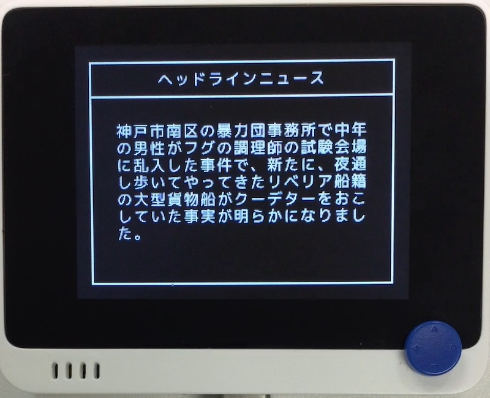

# Sentence...?

## 概要
こちらの~~パクリ~~移植。 
https://www.vector.co.jp/soft/mac/writing/se090025.html  
ニュースなど捏造します。

## ファイル
   [`sen.py`](/CIRCUITPY/sen.py), `sen_dic/*.dic`

## ライブラリ
   [`Sentence.mpy`](/libsrc/Sentence.py)

## 操作
- ←→ : 辞書を切り替えます。
- "X" : 次の文章を捏造します。

辞書のフォーマットや他の辞書についてはパクリ元を参照してください。
辞書データは全角のみの対応で、UTF-8 (LF) 形式で保存します。
サンプルとして、パクリ元謹製の辞書 (を変換したもの) 他を置いておきます。
