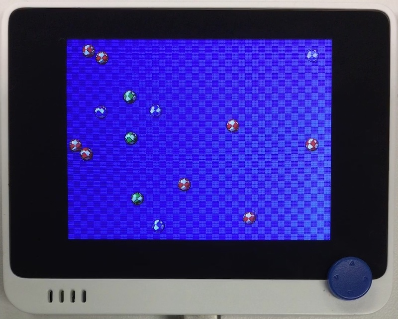

# Stage

## 概要
Stage は CircuitPython 用のゲームライブラリです。
Wio Terminal への移植はこちらを参照:  
https://qiita.com/inachi/items/78b3747b84671c098765

Stage を組み込んだカスタムファームウェアが必要になります。
CircuitPython 7.0 で `gamepad` モジュールがなくなったので、`ugame.py` を差し替えています。
また CircuitPython 7.1 より scale がサポートされ、Wio Terminal でもかなり「使える」ようになりました。

デモのボールを増やしました。

## ファイル
   `ball.py`, `ball.bmp`

