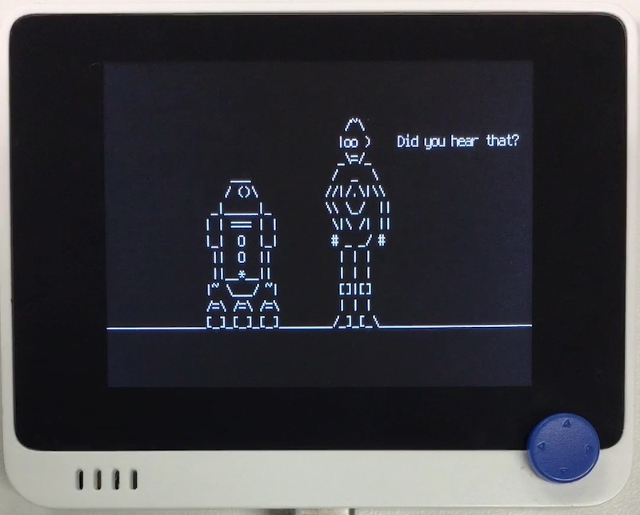

# StarWars

## 概要
こちらの~~パクリ~~移植。 
http://www.asciimation.co.nz

データはローカルに保持し、ネットワーク接続はしません。
データ圧縮のため、`uzlib` 込みのカスタムファームウェアが必要になります。

## ファイル
   [`starwars.py`](/CIRCUITPY/starwars.py), `sw1.txt.gz`

## 操作
- "X" : 早送りします。
- そのほかのキー: もっと早送りします。
- "→" : もっともっと早送りします。

