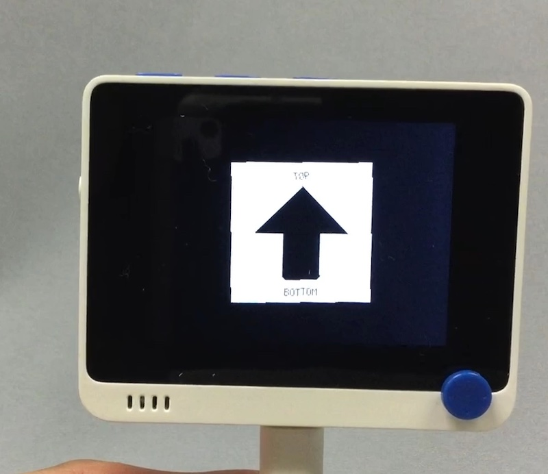

# 加速度センサー

## 概要
加速度センサのデモ。

[](https://www.youtube.com/watch?v=DdqUJ4dByI4)

## ファイル
   [`roto.py`](/CIRCUITPY/roto.py)

## ライブラリ
   `adafruit_lis3dh.mpy`, [`MotionEvents.mpy`](/libsrc/MotionEvents.py)

## 操作
```
import roto
```
